## Состав пакета
В состав пакета входят следующие файлы:
- *k410odcl.odcl* — проект пакета OpenDCL, включающий в себя диалоговые окна **k410 ODCL**;
- *ADOLISP_Library.lsp* — LISP-пакет функций подключения к источникам данных;
- *k410odcl.lsp* — LISP-пакет **k410 ODCL**;
- *acaddoc.lsp* — файл, загружаемый для каждого открываемого чертежа, включающий в себя строку загрузки пакета;
- *OpenDCL.Runtime.X.X.X.X.msi* — установочный файл пакета [OpenDCL](https://opendcl.com/wordpress/)

## Установка пакета
1. Установить RunTime-компонента OpenDCL -- OpenDCL.Runtime.X.X.X.X.msi. 
2. Скопировать оставшиеся файлы пакета в папку `\Support\`, расположенную в папке, в которую установлен AutoCAD, например — `c:\Program Files\Autodesk\AutoCAD 2011\Support\`.
  
После установки пакета он будет автоматически загружаться при открытии любого чертежа:

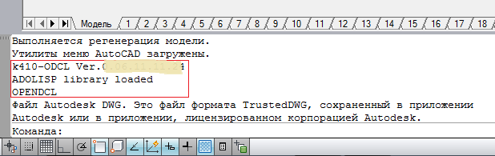

## Подключение к источнику данных, создание схемы адресов данных
Подключение к источникам данных осуществляется с применением файлов UDL (Universal Data Link), в которых указывается вся необходимая информация для организации подключения к источнику данных.
Для создания файла UDL необходимо (например):
- создать пустой текстовый файл (с расширением «txt») и сменить его расширение на «udl»;
- запустить на исполнение полученный файл, после чего откроется диалоговое окно, где необходимо указать поставщика данных, полный путь к файлу источника данных, права доступа, логин и пароль или иную служебную информацию, необходимую для подключения к выбранному источнику данных:

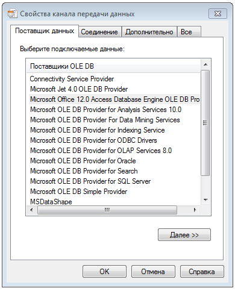

Для создания схемы адресов данных атрибутов блока необходимо в чертеже AutoCAD-а выбрать вхождение блока, нажатием правой кнопки мыши вызвать контекстное меню, и выбрать пункт *Адреса данных*:

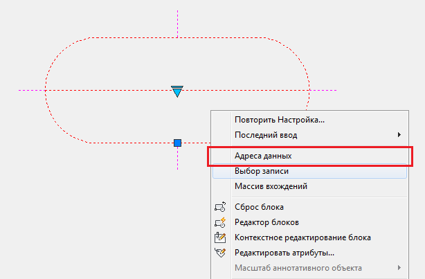

В открывшемся диалоговом окне необходимо нажать кнопку *[Источник данных]*:

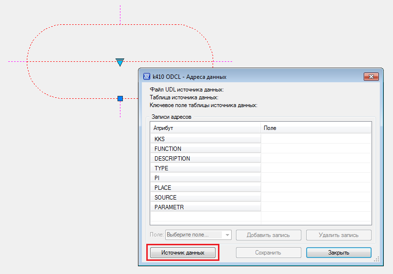

Далее — указать созданный файл описания источника данных (UDL файл):

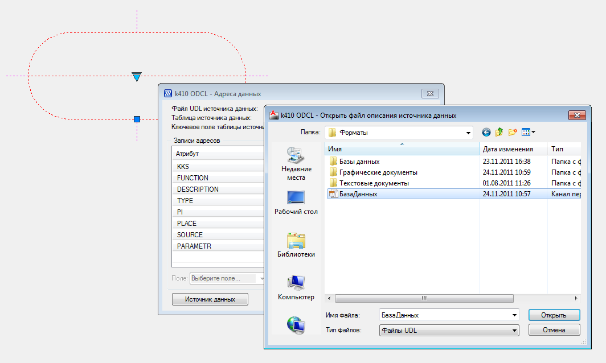

Далее — указать таблицу или запрос источника данных, которую (-ый) необходимо подключить к выбранному блоку, затем — поле таблицы (запроса) , которое будет использоваться в качестве ключевого:

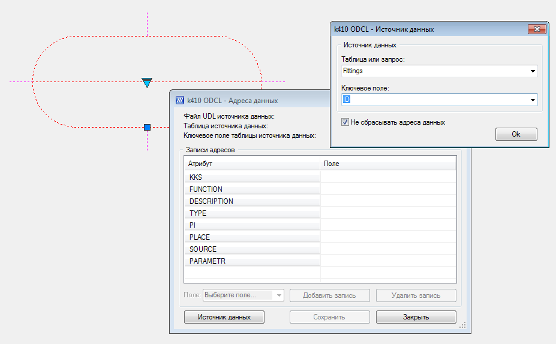

Нажатие кнопки *[Ok]* сохранит информацию об источнике данных в описании блока. Для выхода из диалога без сохранения информации об источнике данных необходимо нажать кнопку *[Esc]* или закрыть диалог. Если снять флажок *[Не сбрасывать адреса данных]*, то после закрытия диалога выбора источника данных по нажатию кнопки *[Ok]* в диалоговом окне адресов данных для атрибутов блока будут сброшены значения полей таблицы источника данных.  
  
После подключения источника данных можно создавать схему адресов данных для атрибутов блока (указать поля таблицы источника данных для каждого атрибута):

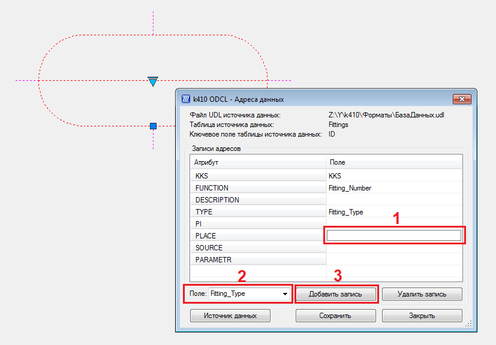

Для добавления адреса данных необходимо:
1. Выбрать строку в столбце *[Поле]* соответствующего атрибута.
2. Из выпадающего списка *[Поле]* выбрать наименование поля таблицы источника данных.
3. Нажать кнопку *[Добавить запись]*.
  
Для удаления адреса данных необходимо выбрать строку в столбце *[Поле]* соответствующего атрибута и нажать кнопку *[Удалить запись]*.  
  
Для сохранения в описании блока созданной схемы адресов данных необходимо нажать кнопку *[Сохранить]*.  
  
После сохранения схемы адресов данных диалоговое окно адресов данных может быть закрыто. В том случае, если схема адресов данных создавалась для блока впервые, будет открыто окно диспетчера атрибутов блока. При помощи диспетчера необходимо обновить вхождения блока. Для этого нужно нажать кнопку *[Выбрать блок]*, выбрать вхождение блока и нажать кнопку *[Обновить]*, после чего диспетчер может быть закрыт:

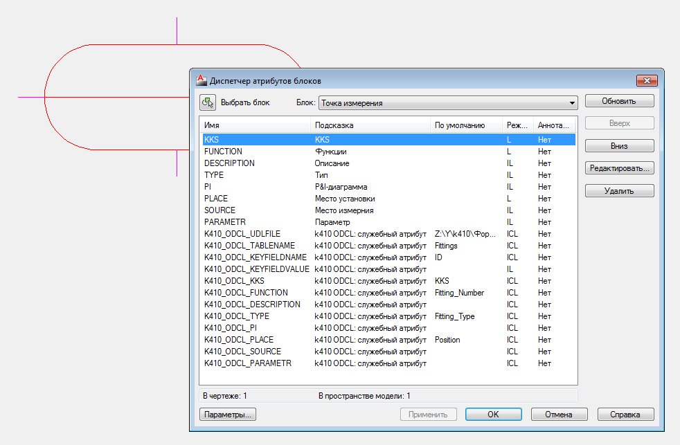

## Загрузка записи источника данных в атрибуты вхождения блока
Для выбора записи таблицы источника данных необходимо в чертеже AutoCAD-а выбрать вхождение блока, нажатием правой кнопки мыши вызвать контекстное меню, и выбрать пункт *[Выбор записи]*:

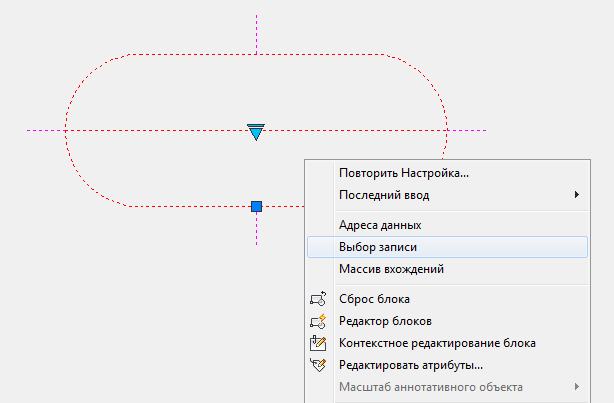

Выполнение данной функции начнется с подключения к источнику данных, загрузки набора данных в оперативную память и формирования списка значений ключевого поля:

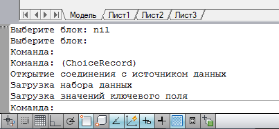

Затем открывается диалоговое окно выбора записи. В поле диалога *Значение ключевого поля*  необходимо вести значение ключевого поля и нажать кнопку *Найти*:

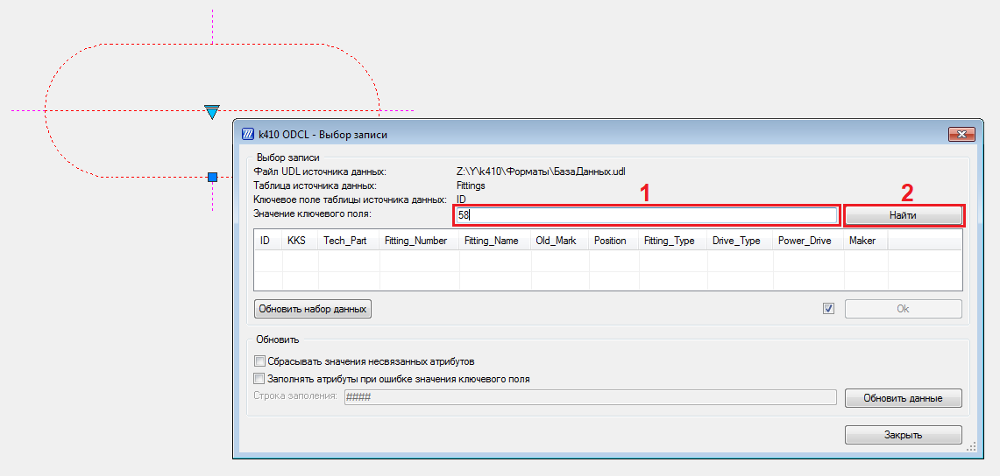

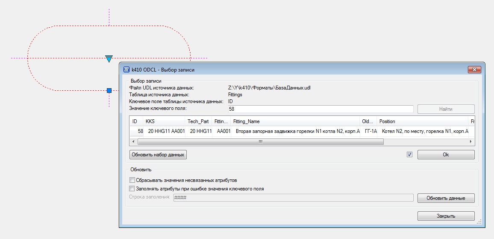

Если значение ключевого поля не является ошибочным, то из набора данных будет извлечена соответствующая запись, которая отобразится в диалоговом окне. После нажатия кнопки *[Ok]* в атрибуты вхождения будут записаны значения полей выбранной записи в соответствии со схемой адресов данных, в том числе и само значение ключевого поля. При этом если установлен флажок, расположенный рядом с кнопкой *[Ok]*, диалоговое окно будет закрыто.  
  
Для ускорения процесса выбора записи набора данных и заполнения атрибутов вхождения достаточно ввести значение ключевого поля таблицы источника данных в поле *Значение ключевого поля* диалога и нажать клавишу *[Enter]* — это приведет к поиску записи в наборе данных, записи значений полей в атрибуты вхождения и закрытию диалога.  
  
Используя диалог выбора записи можно обновить набор данных, хранящийся в оперативной памяти. Для этого достаточно нажать кнопку *[Обновить набор данных]*.  
  
Также, используя этот диалог, можно обновить данные атрибутов всех вхождений выбранного блока. Для этого достаточно нажать кнопку *[Обновить данные]*. В ходе обновления из каждого вхождения блока будет извлекаться значение ключевого поля, из набора данных — соответствующая запись, после чего значения полей записи будут помещены в атрибуты вхождения блока.  
  
Если в процессе обновления данных был установлен флажок *[Сбрасывать значения несвязанных атрибутов]*, то в атрибуты вхождения, для которых не указан адрес данных, будет помещена пустая строка. Если в процессе обновления данных был установлен флажок *[Заполнять атрибуты при ошибке значения ключевого поля]*, то при возникновении ошибки значения ключевого поля в атрибуты вхождения, для которых указан адрес данных, будет помещена заданная в диалоге строка (по умолчанию — “####”).

## Создание массива вхождений блока
При решении практических задач часто бывает удобно создавать массивы вхождений блока с автоматической записью во вхождения значений ключевого поля таблицы источника данных. Значения ключевого поля могут быть взяты из списка значений, который формируется при загрузке набора данных в оперативную память, либо из списка значений, сформированного дополнительными командами пакета k410 ODCL.  
  
Для создания массива вхождений блока необходимо в чертеже AutoCAD-а выбрать вхождение, нажатием правой кнопки мыши вызвать контекстное меню, и выбрать пункт *[Массив вхождений]*:

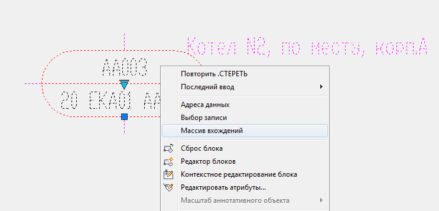

В открывшемся диалоговом окне необходимо указать список значений ключей, который будет использоваться при создании массива вхождений, и размеры массива:

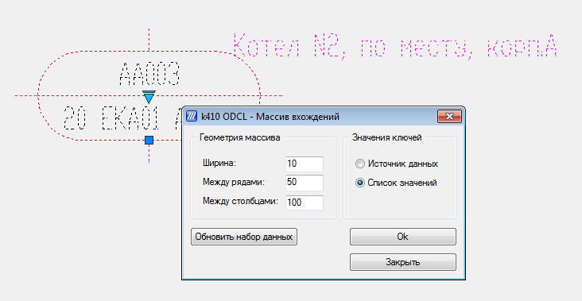

После нажатия кнопки *[Ok]* необходимо указать базовую точку массива, от которой он будет строиться.  
  
Массив вхождений формируется в виде прямоугольника, состоящего из рядов и столбцов. Ширина массива — количество столбцов. Количество рядов зависит от количества вхождений, ширины массива и определяется при построении массива.  
  
Массив строится по рядам, т.е. сначала строится ряд вхождений размером в ширину массива, после чего происходит переход на следующий ряд. Если указано положительное расстояние между столбцами, тогда ряд будет строиться вправо от базовой точки массива, если отрицательное — влево от базовой точки. Если указано положительное расстояние между рядами, тогда следующий ряд будет выше базовой точки, если отрицательное — ниже базовой точки. Таким образом, указывая знаки расстояний между столбцами и рядами можно указать направление построение массива от базовой точки: вправо-вверх, вправо-вниз, влево-вверх, влево-вниз.  
  
Используя диалог массива вхождений (аналогично диалогу выбора записи) можно обновить набор данных, хранящийся в оперативной памяти. Для этого достаточно нажать кнопку *[Обновить набор данных]*.

## Дополнительные команды и функции пакета
В составе пакета k410 ODCL реализованы команды и функции, не имеющие диалоговых окон, но расширяющие функциональные возможности пакета и во многом упрощающие работу с вхождениями блоков, имеющими схемы адресов данных. Ниже перечислены эти команды и функции.  
  
**k410_Ver** — вывод информации о версии пакета.  
  
**k410_GetKeyValues** — загрузка значений ключей из вхождений блоков, находящихся в группе выделенных элементов чертежа. Значения ключей сохраняются в списке *KeyValues* и текстовой строке *KeyValuesStr*, в которой значения ключей разделены разделителем, указанном в переменной *StrDelimiter* (по умолчанию — “, ”). Если значение переменной *KeyValuesClear* равно “T”, то перед выполнением команды список *KeyValues* и строка *KeyValuesSt*r сбрасываются (KeyValues = nil, KeyValuesStr = “”). Если значение переменной *KeyValuesClear* равно “F” — список и строка значений не сбрасываются.  
  
**k410_gkv** — короткий псевдоним команды **k410_GetKeyValues**. По окончанию выполнения команды на экран выводится строка значений ключей.  
***Примечание***: команды **k410_gkv** и **k410_GetKeyValues** извлекают значения ключей всех вхождений выделенной группы, т.е. если в выделении присутствуют вхождения разных описаний блоков, подключенных к разным источникам данных, то в итоговых списке и строке будут присутствовать значения ключей всех этих вхождений.  
  
**k410_KeyValuesClear** — сброс значений *KeyValue*s и *KeyValuesStr*.  
  
**(ListOR List1 List2)** — объединение двух списков:
вход: *List1*, *List* — списки;
выход: список, состоящий из элементов списка *List1* и *List2*.  
  
**(ListAND List1 List2)** — пересечение двух списков:
вход: *List1*, *List2* — списки;
выход: список, состоящий из элементов, которые присутствуют одновременно и в списке *List1*, и в списке *List2*.  
  
**(ListXOR List1 List2)** — симметричная разность двух списков:
вход: *List1*, *List2* — списки;
выход: список, состоящий из элементов списка *List1*, которых нет в списке *List2* и из элементов списка *List2*, которых нет в списке *List1*.
